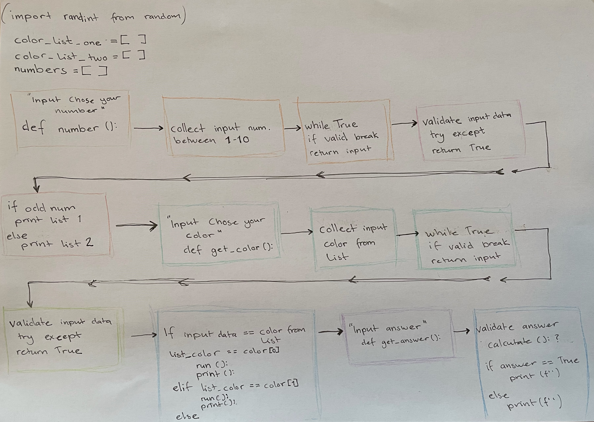

# Loppan

Loppan is the Swedish word for the fun yet simple paper origami game: pick a color, fortune teller, or chatterbox (It's a game with many names).
It's a game where you create a "Loppa"/fortune teller with 8 different tasks or questions to execute. Each assignment or question has its color. This Loppan game is a math learning game with basic math equations for the player to solve.

Image from [amiresponsive](http://ami.responsivedesign.is/?url=https%3A%2F%2Floppan.herokuapp.com%2F)

## User Stories
The User Stories for this project are the following:
* A welcome menu that gives the user different options on how to proceed with the program. 
* A section about the game with relevant information. Information such as how to play the game, the game's different names, and from where the game originates.
* The game and all its functions and features.
* Instructions on how the user can create their own paper Loppa.

### Workflow (include screenshots of your workflow)
The Flowchart of the main game function

## Features
### Existing Features
#### Menu
  The user will first encounter a menu when starting the program. The menu gives the user four options to choose between: 
  * About the Game
  * Play the Game 
  * Create your Own 
  * Exit
  
Each of these options will run a function that either prints text with information or instruction, starts the game, and, lastly, exit the program.
Suppose the user enters a number, not between 0 to 3, a letter, or any other character or blank. In that case, a print statement will be displayed for the user, letting them know that they entered an invalid value and asking them to insert one of the valid options. 

See [TESTING.md](TESTING.mg) for more images about print statement for invalid input.

#### Section about the Game
The about section gives the user informational text about the game Loppan.  All the common names it goes under in English. The user can also read about the game rules, from where the game originated, and get the acknowledgment in the western world. 
The section also provides references to websites with more information.

    

#### Game
The game starts with the user selecting a number between 1 to 10. 
For the player to submit a number is done with an input request. If the user tries to submit a number lower than 1 or higher than 10, a letter, a special sign, or a blank space, they will receive an Error message telling them to insert the correct value. Once the right value is submitted, the terminal will print the chosen number and take the player to the next step of the game.

When the Loppa has validated the chosen number, a list will be printed in the terminal, containing 4 colors, text instruction, and an input field. 
The instruction will tell the player to choose 1 of the 4 colors from the given list into the input field. As with the number input, if the player tries to submit a value that is not one of the colors from the list or a number or other special sign, they will get an Error message, telling them to submit the correct value to proceed with the game.
* See [TESTING.md](TESTING.mg) for more images about print statement for invalid input.

List 1:

List 2:

When the user has submitted a valid value, they will get a task to execute from the selected color. In this case, a math equation of either addition, subtraction, multiplication, or division. 

The math equation will always be a new one if the player, for example, picks multiplication two times in a row.

See [TESTING.md](TESTING.mg) for more images about the other math equations.

The game consists of 3 "Lives", similar to rounds the game has before ending. It allows the player to answer each round incorrectly 3 times before the game ends. If the player answers the question correctly, the game will continue. 

When the player has lost all of the lives in the game, an option will be displayed to let the player choose to either play the game again or leave the game and come back to the start menu.

#### Instructions on how the user can create their own paper Loppa
The instruction section is a walk-through guide that the user can follow to create their own Loppa. It provides the user with the necessary tools and supplements that are needed to make one.
To make it easier for the user to follow the instruction one at a time, the user needs to press Enter to move forward with the instructions.

Step 1: 

Step 2:

Step 3:

Step 4:

Step 5:

### Features Left to Implement
* A feature to implement would be to connect more "Loppor"/Fortune tellers; for example, the player could choose to play one with math or words or learn words from different languages.

* Install coloram and apply color to the game would be a nice feature if there were more colors to choose. 

## Technologies Used
* Python: Python is used to build the core structure and code for the project

* [Heroku](https://www.heroku.com/home): Heroku is the deployment environment used to deploy the project and connected with the GitHub repository

* [Gitpod](https://gitpod.io/): Gitpod is the development environment used for developing all the code during this project

* [GitHub](https://github.com/): GitHub are used to store the repository for this project

* Git: Git is used to create backups of the project and ensure that all versions of the project is pushed to GitHub

## Testing
To view all tests for this project, please refer to the [TESTING.md](TESTING.md) file.

## Deployment
The site was deployed to Heroku. The steps to deploy are as follows:
* Go to the [Heroku](https://www.heroku.com/home) site, [sign up](https://signup.heroku.com/login) for free if you do not already have an account.
    * If creating an account, fill in the signup form with name.
* On the dashboard page, navigate to the Create New App button and click.
* Give the app a unique name; it can not have the same name as another app, choose the region you are currently located in and select Create app.
* On the apps dashboard page, navigate to the Settings tab.
* On the Settings page, go down to the config vars section. 
* Create a config var, set the key to `PORT`, value to `8000`, and click add. 
* Navigate down to Buildpacks and select "Add buildpacks".
* Select `python` and click "Save changes". Click "Add buildpacks again and select `nodejs`, click "Save changes". Make sure that python is at the top of the list in the buildpacks field.
* Navigate to the Deploy tab and down to the section called Deployment method. 
* Select GitHub and confirm the connection between Heroku and GitHub.
* Search for the project's repository name on GitHub and click "connect" to link GitHub with Heroku.
* On the same page, scroll down and choose how to deploy the app. For this project, automatic deploys are selected and enabled.

The live link can be found here - [https://loppan.herokuapp.com/](https://loppan.herokuapp.com/)

### Local Deployment
In order to make a local copy of this project, you can type the following into your IDE Terminal to clone this repository:

- `git clone https://github.com/stroemlind/loppan.git`

Alternatively, if using Gitpod, you can click below to create your own workspace using this repository.

## Credits
### Content
* Information about how to create the menu [This Video](https://www.youtube.com/watch?v=63nw00JqHo0) was of guidance
* This blogpost from [Computinglearner](https://computinglearner.com/how-to-create-a-menu-for-a-python-console-application/) was also of guidance to create the menu
* Infromation about "Loppa"/Fortune tellers from [Wikipedia](https://en.wikipedia.org/wiki/Paper_fortune_teller)
* Information about "Loppa"/Fortune tellers from [Origami heaven](http://www.origamiheaven.com/historyofthesaltcellar.htm)
* Information on how to write a mulit-line print was found on [Pythonprogramming](https://pythonprogramming.net/multi-line-printing-python-3/)
* Information on how to set the range in get_player_num function was found on [Stackoverflow](https://stackoverflow.com/questions/19821273/limiting-user-input-to-a-range-in-python)
* Information on how to validate input value was found on [COmputing101](https://www.101computing.net/number-only/)
* Infromation on how to use the clear function and import was found on [GeeksforGeeks](https://www.geeksforgeeks.org/clear-screen-python/) and my mentor Tim Nelson
* Infromation on how to use Try/Except in code was found on [Tutorialbrain](https://www.tutorialbrain.com/python-try-except/)
* More infromation on how to use Try/Except in code was found on [W3Schools](https://www.w3schools.com/python/python_try_except.a)
* How to import and use the sys.exit function was given by Time Nelson during a mentor call.
* Information on how to use enumerate() was found on [Realpython](https://realpython.com/python-enumerate/)
* Information on how to import time and use the time.sleep() function was provided by Tim Nelson during a mentor call.

### Media
All the images in this project are screenshots taken by the creator and only used in the README.md and TESTING.md 
* [Amiresonvsive](http://ami.responsivedesign.is/?url=https%3A%2F%2Floppan.herokuapp.com%2F) for making the responsiveness image

### Acknowledgements
First, I would like to acknowledge my mentor Tim Nelson, who always tries to help me create good a project as possible. He provided me with information about some build-in functions and recommended I look into other program functions. He gave feedback and ideas on how I could evolve the whole program and game to where it is now. 
Tim also helped me recommend adding an if/else statement with print() to the get_answer function. That would print different messages depending on how many lives the player had left during the game.
I would also like to acknowledge the help from my friend Johan, who helped me with feedback and implementing the 3 lives/tries a player has during the game.
I also want to thank the Code Institute tutor John, who gave me significant input on how to approach debugging my code in another way.