## Testing
The local terminal in Gitpod and the Code Institute, Heroku terminal, was used to test the program and code. 
Throughout the testing of each function, I checked the error messages, tried different approaches how to rewriting or fixing the code. 
To see if the math equations' calculation was correct or not, I had a calculator at hand. 

### Code Validation
The code passed through [PEP8 linter](http://pep8online.com/checkresult). The result confirmed there are no problems with the code.

### Browser Compatibility
* Google Chrome
  * The program runs without any issues in the Google Chrome browser

  

* Mozilla Firefox
  * The program runs without any issues in the Mozilla Firefox browser

  

* Microsoft Edge
  * The program runs without any issues in the Microsoft Edge browser

  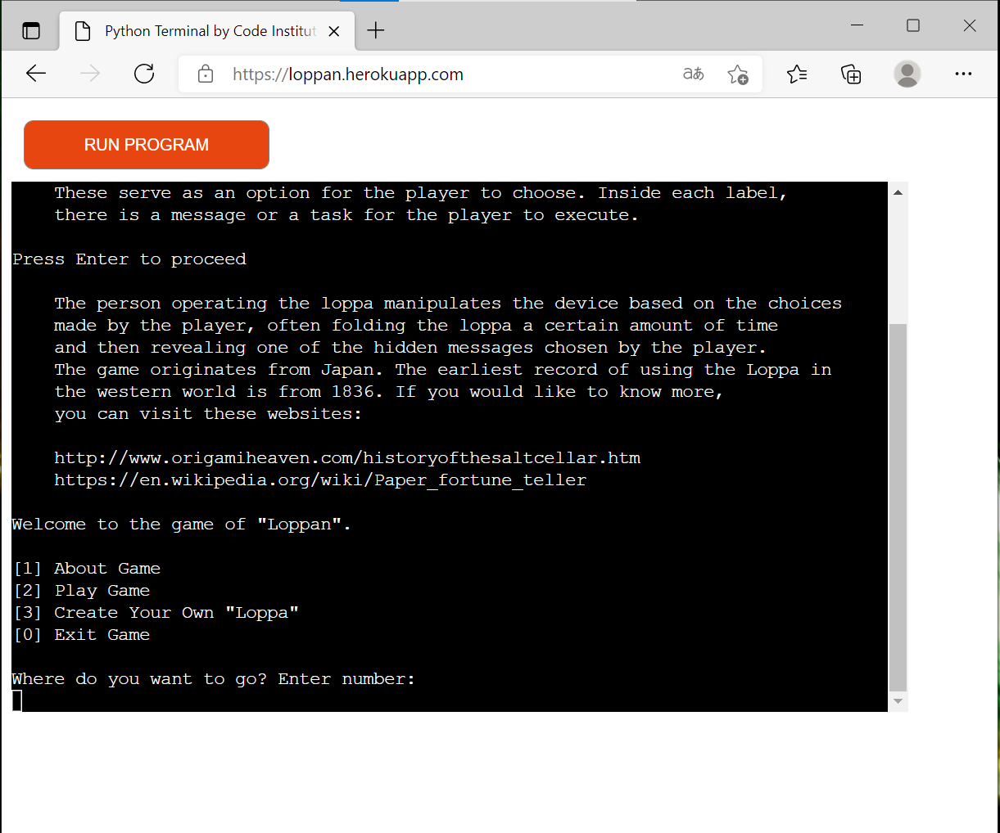

* Safari
  * The program runs without any issues in the Safari browser

  

### Tested User Stories
#### Menu
To navigate through the menu, the user can choose between the numbers 0 to 3. If the user enters a value that is not the number between 0 to 3, the print statement displays on the screen and asks the user to enter a valid value. 

 

#### Section About the Game
When selected, the first part of an informational text about the game appears in the terminal for the user to read. The user can not go forward with the text if not pressing "Enter". If the user tries another key, it will only show next to the instruction until "Enter" is clicked.
At the bottom of the terminal, the menu appears again for the user to navigate to another section of the program.

#### Game
The game runs in the flow of the set game rules and the order described in the Existing Features. 
At the first input, choose a number between 1 to 10; if the player tries to enter a value that is not valid, an error message will be printed in the terminal, asking the user to enter a correct input.

* Beginning of the Game

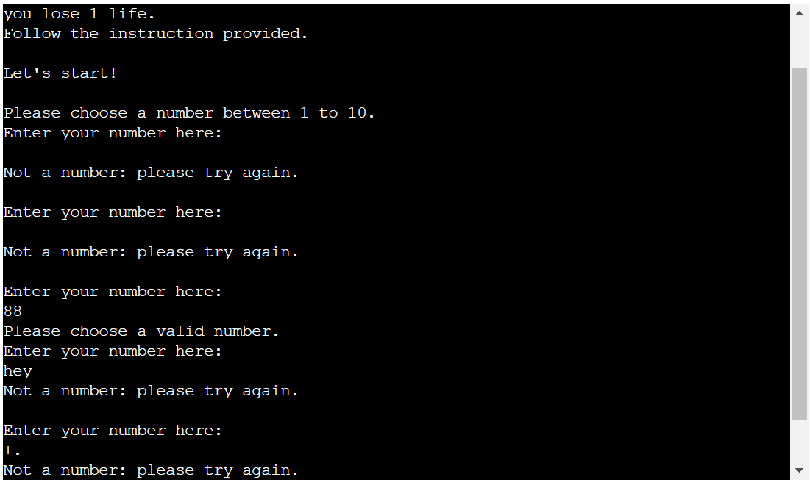

* During the game

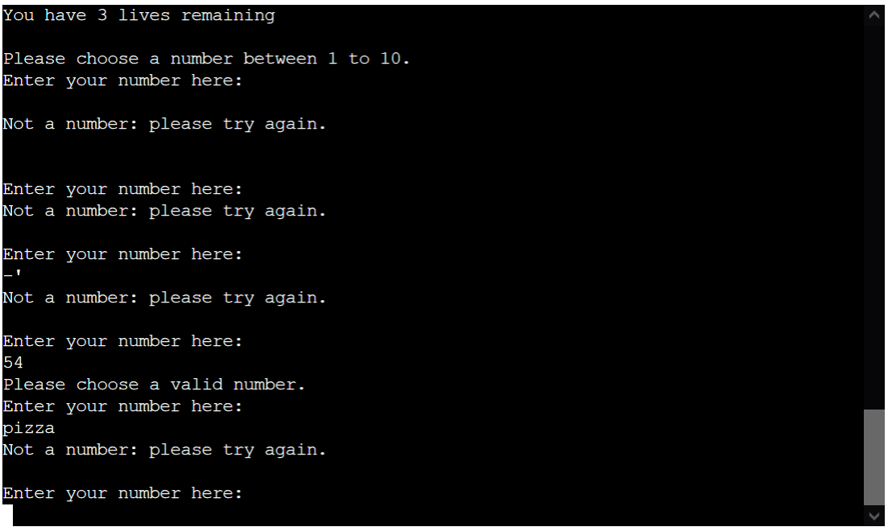

Depending on the user entering an odd or even number, the terminal will print four colors for the player to choose. 

* Result odd number

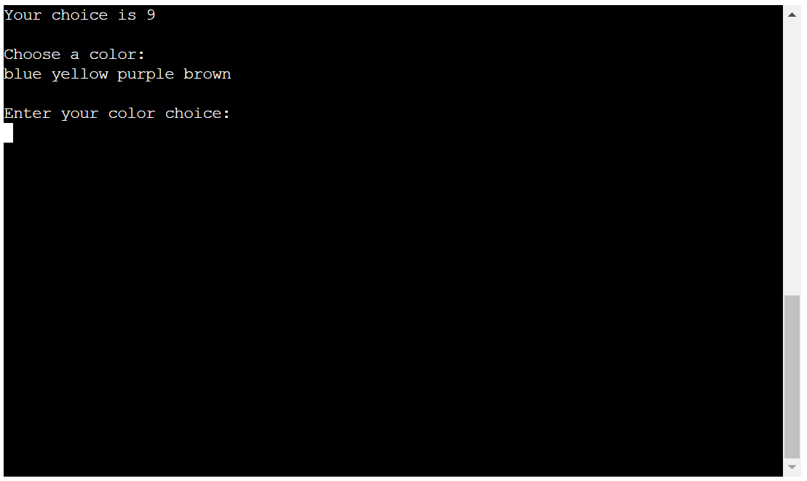

* Result even number

The second input for the player is to choose one of the four colors printed in the terminal. Suppose the player tries to enter a color written differently than presented or enter any other character, number, or special sign. In that case, an error message will be printed in the terminal telling the player to enter a valid input.

Depending on which color the player chooses, a math equation will display in the terminal to answer. The color will always have the same equation, but the numbers in the equation will be different for each new round. A the moment, the numbers will be between 1 to 20, and there will never be a negative result or decimals in the answer.

* Addition

 

 

 

 

* Subtraction

 

 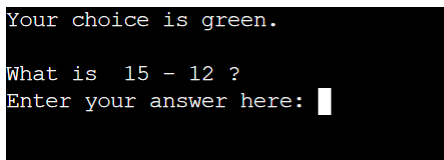

 

 

* Multiplication

 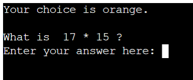

 

 

 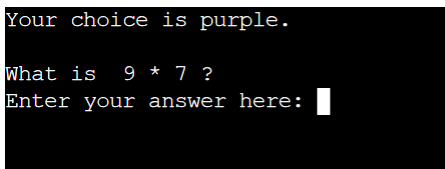

* Division

 

 

 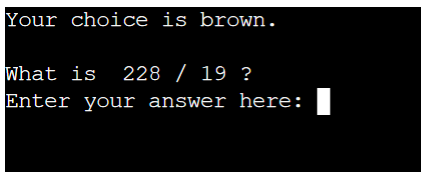

 

If the player tries to answer the question with a character that is not a number, an error message will display in the terminal, asking the user to insert a valid answer.

When the player has answered the question, depending on if the answer is correct or incorrect, a message will display in the terminal, letting the player know if they are correct 

or incorrect:

If the player answers a question wrong, they will lose on "life" of the 3 given at the start of the game. If they answer the question correctly, the game will go on back to choose a number again. The number of lives will only change if the player answers the question wrong. 
The player will be able to keep track of their lives through a printed message in the terminal.

* Correct answer:

* Incorrect answer:

When the player has answered the questions wrong 3 times, a message will display in the terminal letting the player know that they lost all of their lives and ask the player if they want to play the game again or not. 

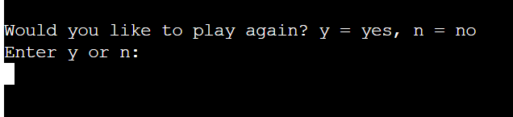

If the player wants to play again or not, they can only go forward with their decision if the input value is "y" for yes or "n" for no. Suppose the player tries to put in another than the valid value, an error message will display in the terminal, telling the player to enter a valid value.

If the player decides to play again, the game will be reset and start again with 3 new lives. 

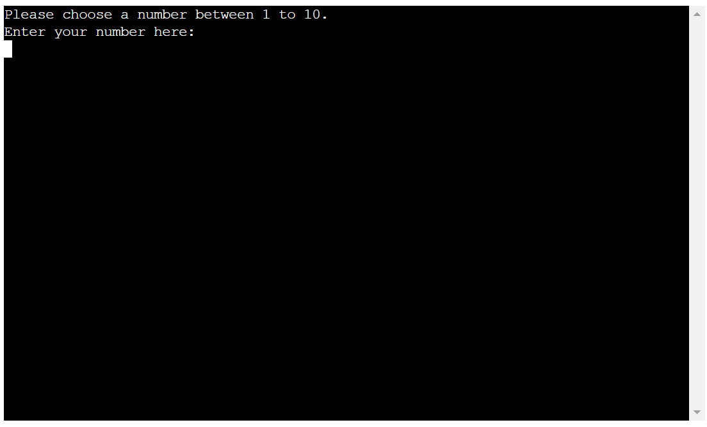

If the player decides not to play another game, a message will display in the terminal, thanking the player for playing the game and taking them back to the start menu.

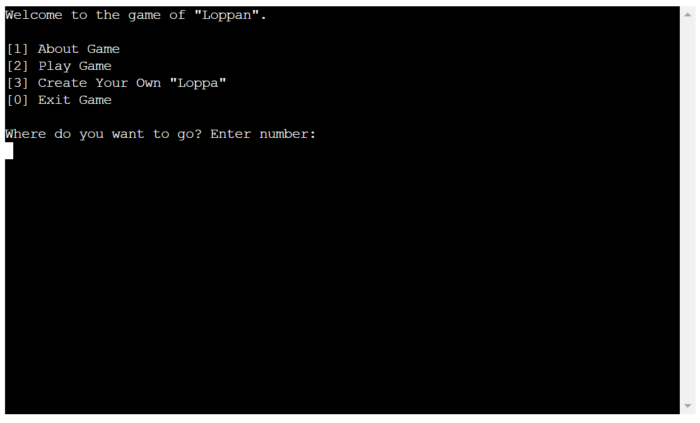

* Instructions on how the user can create their own paper Loppa
When selected, the flow of the text is going as it should. The user can only move forward if they press Enter. If the user presses another key, then nothing will happen. The user needs to press Enter the whole way to get back to the menu.

### Unfixed Bugs
* The clear() function does not clear the terminal to the top. Depending on how much the user goes through the program, some of the previous visit sections are still showing.

* When a user put in an invalid value to the input field in the menu, the error message would not show what kind of value the user had supplied. To fix this, I made it only to show that an invalid value had has been used. 
